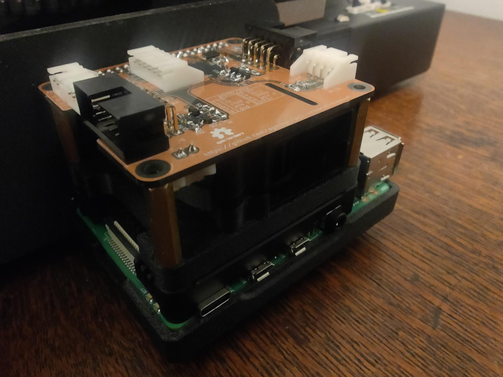
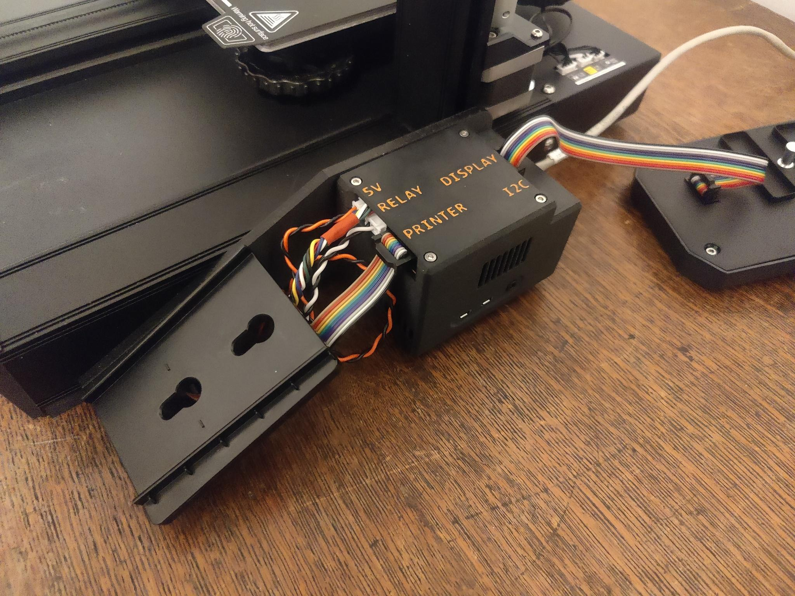
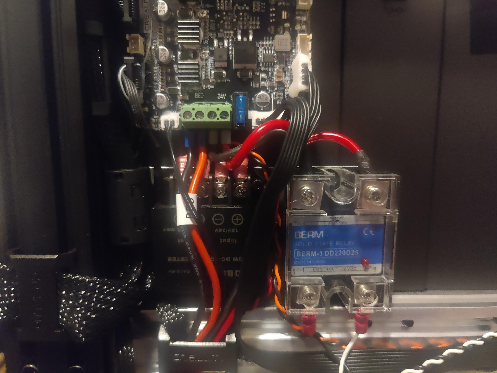

Some time last year, MicroCenter had a sale on the Ender 3 S1. My girlfriend with a chronic 3D printing condition said that it was a decent printer for the price bracket.[^1] So I picked one up. It's proven to be helpful in many ways, and has enabled projects that would have previously involved road trips--I love visiting my girlfriend, but spending 4 hours driving every time I want to 3D print something is not how I want to spend my life.

As an example, the first major non-printer project I did successfully on this printer was a shield project for the lightsaber class I teach. I was able to design and print shield handle brackets on my own.[^2] Even being able to print prototypes and test fits is a big help.

However, after only a few projects, I am already feeling the limits of the stock firmware. With Orca Slicer, I seem to be having overextrusion problems, felt most strongly with supports sticking too aggressively. The standard firmware lacks features. And I would love to not do the SD card dance. (It's not _that_ big of a deal, but if I'm doing the rest of this anyway, might as well.)

So my design requirements are:

* Use Klipper, because might as well go for broke
* Try to use stock hardware and electronics--namely the standard screen
* Minimize loopbacks and weird dangling cables--I want the final product to be tidy and maybe look stock[^3]


[^1]: That modifier clause sure is doing some heavy lifting there. She might have paid twenty times what I did for her Bambu X1C, but boy howdy does it run sprints around my Ender in a plethora of ways.

[^2]: That girlfriend helped a lot with the wooden shield blanks, and she did design and print the Mk2 version of the handle. The work she did with the straps turned out to be completely useless, though.

[^3]: If I take off my glasses and squint


## Design

### Software

Ok, so we're going to be playing in the Klipper ecosystem. That means either OctoPrint or Moonraker & Friends.

The hardware will be a Raspberry Pi 4, mostly cause it's an easy and well-supported default, and I don't feel like going down the SBC rabbit hole.

There are [drivers](https://github.com/odwdinc/DWIN_T5UIC1_LCD/network) for the stock screen, but only for Moonraker. So let's go with that.

Moonraker is only an API, and has two major frontends: Mainsail and Fluidd. MainsailOS is maintained, unlike FluiddPI, so let's go with Mainsail.


### Compute

(A lot of credit goes to @agmlego and @mtfurlan for this hardware, but I will be putting my own spin on this.)

Ok, so let's start with a Raspberry Pi 4.

Let's give it a heatsink and fan. The [Geekworm 11mm heatsink](https://geekworm.com/products/p165-b)[^4] and a [blower](https://www.amazon.com/dp/B08R9HB2XC) to direct air out the side.

For a power supply, let's use a packaged 24v-5v DC-DC converter, like [this one](https://www.amazon.com/dp/B00J3MHRNO).

@mtfurlan was kind enough to give me one of her OctoPrint IO boards ([Hardware GitHub](https://github.com/mtfurlan/um2-octoprint-breakout), [Software Blogpost](https://technicallycompetent.com/octoprint-physical-buttons/)). But I want more IO than that (namely, connectors to the front screen and driver board).


[^4]: Do not use the included silpads, they are too thick and there are reports of people cracking their Pis. Use some PC thermal paste instead.


### Electronics

So how does that compute integrate with the printer?

For data, there's a [hardware serial port](https://github.com/Harrypulvirenti/KlipperConfigS1/wiki/UART-Connection), so let's use that.[^5]

Putting a relay into the printer's power means we have a low(er) power mode.

The Raspberry Pi 4 has a `WAKE_ON_GPIO` feature on GPIO3, so lets hook that up to a front-panel button.

I'm going to be using actual connectors and cables for everything--no loose jumper wires.

Some of the sources I'm using for pin assignments:

* https://technicallycompetent.com/octoprint-physical-buttons/
* https://github.com/Harrypulvirenti/KlipperConfigS1/wiki/UART-Connection
* https://github.com/RobRobM/DWIN_T5UIC1_LCD_E3S1/blob/main/README.md#wire-the-display


[^5]: There's also an [internal USB port](https://www.reddit.com/r/3Dprinting/comments/t5ohgq/ender3_s1_serialuart/), but I decided to skip the USB stack.


### Mechanics

I only need a bracket for the Raspberry Pi. I settled on a custom variant of the [Raspberry Pi case (model B+/2/3) with Ender 3 S1 mounting bracket by p1mrx](https://www.printables.com/model/514923-raspberry-pi-case-model-b23-with-ender-3-s1-mounti).


## Building it

### Bracket

"Variant"--the original bracket by p1mrx was for the Pi3, granted with hat space. While there were actual source files available, it looks like the actual Pi3 holding bit was a mesh imported from another project--bad for updating it to Pi4. So I ended up [drawing my own from scratch](https://www.printables.com/model/1090733-raspberry-pi-4-case-for-ender-3-s1-beta).


### IO hat

At first I thought the IO hat was going to be a trivial design I could just wire onto some Adafruit Perma Proto, but when I got to stacks four wires high, I decided maybe I (@agmlego) should [make my own](https://github.com/agmlego/um2-octoprint-breakout).

We ended up with a pinout:

* GPIO0/1: Hat ID EEPROM
* GPIO3: Pi power button
* GPIO4/5: UART to display
* GPIO10/11: I2C for additional sensors
* GPIO12: Display knob press
* GPIO13: Beeper
* GPIO14/15 (TXD/RXD): UART to printer
* GPIO17: Blue LED
* GPIO18: Pi blower PWM
* GPIO19/26: Display knob encoder[^10]
* GPIO22: Printer power sense
* GPIO23: Printer power relay
* GPIO24: Green LED
* GPIO27: Red LED

In case you didn't notice, this is a _lot_ of signals--it's using two-thirds of the GPIO, and no[^11] peripheral is on its default pins. And just for spice, we're also using some non-default peripherals.

When we looked up the HAT+ ID EEPROM ([PDF](https://datasheets.raspberrypi.com/hat/hat-plus-specification.pdf), Ch3), we decided it would just be easier to share the `config.txt` block:

```
# Power button
dtoverlay=gpio-shutdown
# Automated blower control
dtoverlay=pwm-gpio-fan,fan_gpio=18
# Printer power
gpio=23=op,dl
# LEDs
dtoverlay=gpio-led,gpio=17,label=blue,trigger=actpwr
dtoverlay=gpio-led,gpio=24,label=green
dtoverlay=gpio-led,gpio=27,label=red
# Display controls
dtoverlay=gpio-key,gpio=12,label=knobpress,keycode=256
dtoverlay=rotary-encoder,pin_a=19,pin_b=26,relative_axis=1
# Display UART
dtoverlay=uart3
# Beeper
gpio=13=op,dl
# Power sense
gpio=22=ip,np
# I2C
dtoverlay=i2c5,pins_10_11=1,baudrate=400000
```

Note that this relies heavily on kernel subsystems and automation--the knob has been mapped as input buttons (like a funny joystick), the power button LEDs run through the LED system, and the power button and cooling fan are driven by other tools that exist in ~~Raspian~~ Raspberry Pi OS already.

If you're going to tweak this, I strongly suggest [reading the overlay docs](https://github.com/raspberrypi/firmware/blob/master/boot/overlays/README) ([source](https://github.com/raspberrypi/linux/blob/rpi-6.6.y/arch/arm/boot/dts/overlays/README)). Figuring this out was not easy, and required a lot of searching and cross-referencing.


[^10]: These are pins 35 & 37, which makes board routing easier.

[^11]: Fan PWM is still on GPIO18, but that's it.


### Raspberry Pi Stackup

I ended up with the heatsink, a bit of plastic, the blower, and the IO hat discussed above.






(The specific dimensions are vestigial from when the design included the Argon40 fan hat. Which proved to be a weird implementation and made pin assignments markedly harder.)


### Electronics

I ended up with a solid state relay entirely because it was the only thing i3Detroit had that could handle the current.

The DC-DC converter used to power the Pi is as discussed above.

Per the "keep it tidy" requirement, these were shoved into the printer, between the main board and a big structural member. It's.... tight. I don't like working in that space. If I did this again, I might work harder to find smaller components. They are mounted to a bracket, which is almost optional with as much wiring as there is.




### Software

Configuring Klipper, Moonraker, and Mainsail was pretty much standard.

I grabbed MainsailOS and followed the [getting started](https://docs-os.mainsail.xyz/getting-started). The [vendor `printer.cfg`](https://github.com/Klipper3d/klipper/blob/master/config/printer-creality-ender3-s1-2021.cfg) was fine. (Be sure to read the head, both with regard to the specific microcontroller, and the use of hardware serial.) (Astra: Yours is STM32F401, and you did need to use `STM32F4_UPDATE`.) 

I've uploaded my specific configs as [a gist](https://gist.github.com/AstraLuma/fe803b858e34834b4d2317e671df2415). I will specifically call out my power section:

```
[power printer]
type: gpio
pin: gpio23
initial_state: off
restart_klipper_when_powered: True
off_when_shutdown: True
off_when_shutdown_delay: 5
on_when_job_queued: True
locked_while_printing: True
```

I am still in the process of writing [my own screen software](https://github.com/AstraLuma/klipper-pintail), for a few reasons:

* Having the entire application in one mega class was just too much
* Doing encoder decoding in userspace, I think
* It was mostly talking to Kliper directly instead of going through Moonraker
* The screen driver offended my code aesthetics deeply, and if I'm redoing everything _anyway_...

Details on this will be its own blog post, since I ended up using that [game engine I wrote](https://ppb.dev/) to drive and structure the UI. But I have done all the essential framing, and it does have one feature implemented: It'll tell you its IP address and give you a QR code.


### Slicer

I use OrcaSlicer, and it largely works as expected?

1. Put in the printer hostname, and everything will just work
2. Switch gcode dialect from marlin to klipper
3. Do your calibrations


### Calibration

So much! Here's some of what I did:

* Bed levelling screw adjustment
* Z probe offset calibration
* Heater PID calibration
* Flow rate and pressure advance

Everything except the last can be done through Mainsail, and most of them it has nice wizards for! The last is an Orca calibration.

Bed levelling turned out to be a bit of an ordeal to figure out. Do your z probe calibration first, and you might need to start by moving your bed the lowest it'll go. (For me, Klipper would start about several millimeters above the bed, but I hadn't realized my z probe offset was wildly off until I tried a few prints. I suggest doing your z probe calibration before bed levelling.)

There still seems to be some overextrusion problems, but I had those before I started this, and now I have more tools to handle it.


## Results

It was shockingly easy to get to moving and squriting. If I had done some proper prototyping, I could have gotten this done in a day. Very thankfully, the custom hat needed no revisions.
